# Mensah & Partners — Active Directory Lab

## The Problem

Most small businesses in Ghana run their computers with no central management. Everyone uses local accounts, there are no password policies, no access controls and no way to know who accessed what. For a firm handling client financial data, that's not just an IT problem — it's a legal one under Ghana's Data Protection Act.

This lab simulates what it looks like to fix that properly.

---

## What I Built

A fully functional Active Directory environment modeled on a fictional Ghanaian accounting firm — Mensah & Partners. Built from scratch on Windows Server 2022 using VMware Workstation Pro on a Dell Precision 5540.

**The environment includes:**
- A Windows Server 2022 Domain Controller (`MENSAH-DC01`)
- Domain: `mensahpartners.local`
- 4 Organizational Units: Finance, HR, IT, Management
- 8 domain user accounts with department assignments
- 4 Security Groups controlling resource access
- Domain-wide password and account lockout policies
- Department-specific Group Policy Objects (GPOs)
- A Windows 10 workstation joined to the domain
- Full GPO enforcement testing with real user logins

---

## Environment

| Component | Detail |
|-----------|--------|
| Host Machine | Dell Precision 5540, Intel Core i7 9th Gen, 32GB RAM |
| Host OS | Windows 11 26H2 |
| Hypervisor | VMware Workstation Pro |
| Server OS | Windows Server 2022 Standard Evaluation |
| Client OS | Windows 10 Pro |
| Network | VMnet1 Host-Only (isolated lab network) |

---

## Part 1 — Installing Windows Server 2022

After creating the VM in VMware Workstation Pro with 4GB RAM, 2 vCPUs, and a 40GB virtual disk, Windows Server 2022 setup loaded from the ISO.

The first decision is which edition to install. **Windows Server 2022 Standard Evaluation (Desktop Experience)** was selected — the Desktop Experience gives a full GUI which is appropriate for a lab environment where visibility into what's happening matters.

After installation, the first login shows the Server Manager dashboard. At this point, the server is a plain Windows Server with no roles installed.

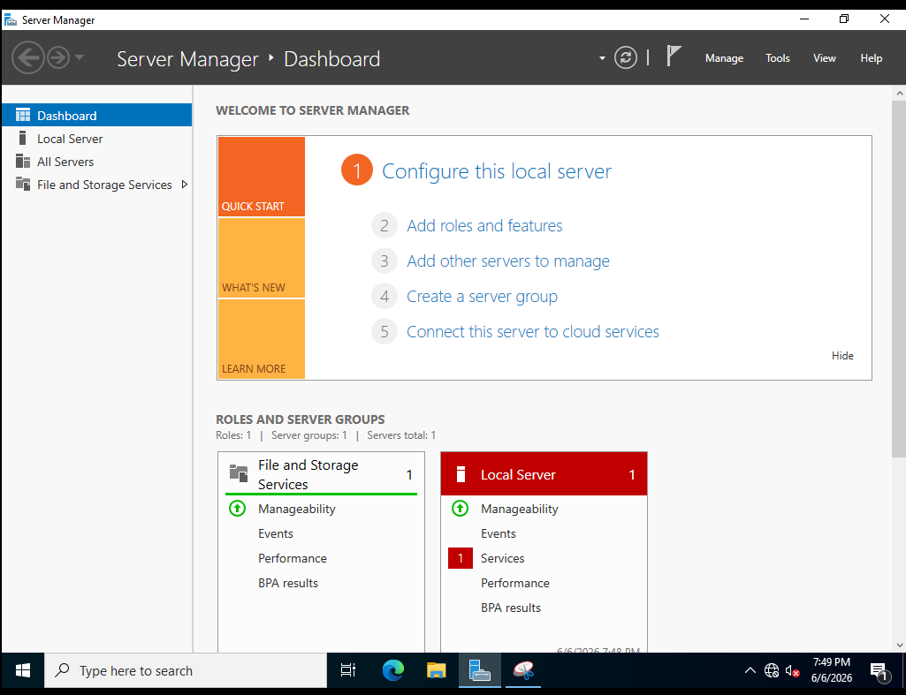

*Server Manager dashboard on first login. No AD roles yet — just a base Windows Server 2022 installation.*

---

## Part 2 — Setting a Static IP Address

Before installing Active Directory, the server needs a static IP. This is non-negotiable for a Domain Controller.

When a computer joins a domain, it stores the DC's IP address to communicate with it for authentication, DNS resolution, and Group Policy. If that IP changes because DHCP assigned a new one, every machine on the domain loses contact with the DC at next login. Users can't authenticate, GPOs stop applying, and the domain goes dark.

**Static IP configured:**
- IP Address: `192.168.10.1`
- Subnet Mask: `255.255.255.0`
- Preferred DNS: `127.0.0.1` (the server points to itself for DNS)

---

## Part 3 — Installing Active Directory Domain Services

In Server Manager, **Add Roles and Features** was used to install the **Active Directory Domain Services** role. After installation completes, the server must be *promoted* to a Domain Controller — installing the role just adds the software. Promotion actually creates the domain.

Clicking **Promote this server to a domain controller** opens the promotion wizard:

- Deployment operation: **Add a new forest**
- Root domain name: `mensahpartners.local`
- Forest and domain functional level: **Windows Server 2016**
- DNS Server: enabled (checked by default)
- Global Catalog: enabled (checked by default)
- DSRM password: set (this is an emergency recovery password used if AD itself fails)

The `.local` suffix is convention for internal domains not exposed to the internet. Using a real public domain name for an internal AD environment can cause DNS conflicts.

After promotion, the server restarts automatically. The login screen now shows the domain name — proof that Active Directory is active.

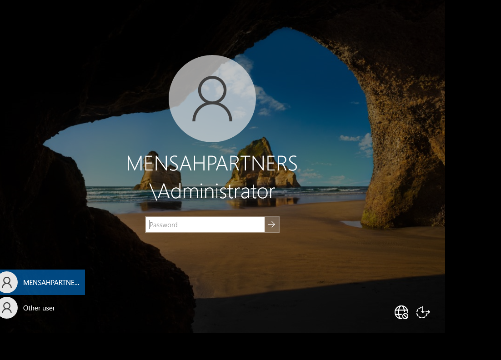

*After promotion and restart, the login screen shows `MENSAHPARTNERS\Administrator`. The domain is live.*

After logging in, Server Manager now shows the **AD DS** and **DNS** roles, confirming both are running.

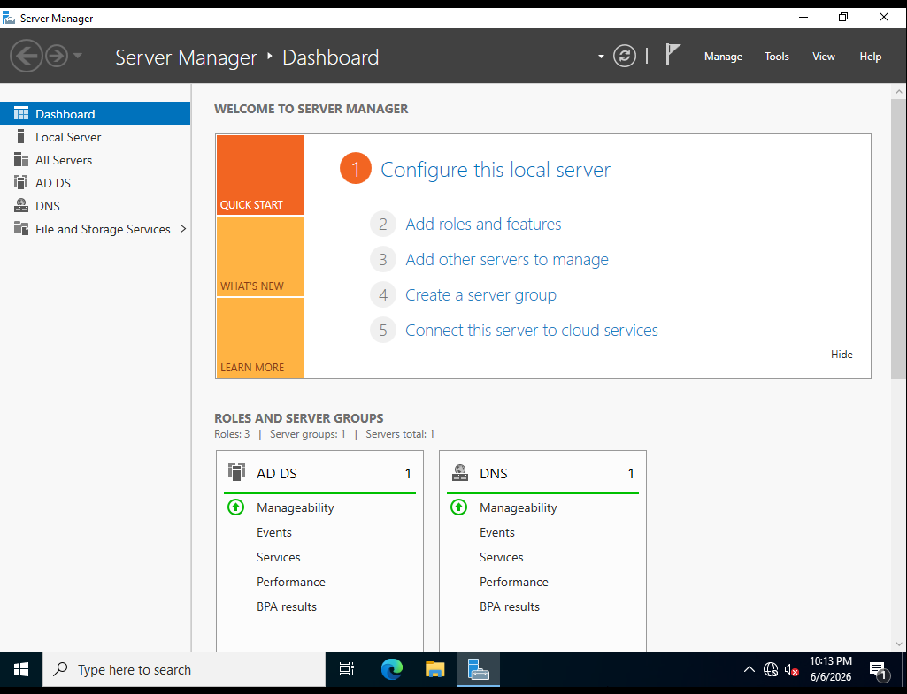

*Server Manager now shows AD DS and DNS as installed roles. Both show green manageability status.*

---

## Part 4 — Verifying the Domain Controller

Opening **Active Directory Users and Computers** from the Tools menu, the Domain Controllers container shows **MENSAH-DC01** registered as a Global Catalog server. This confirms the domain is healthy and the DC is functioning correctly.

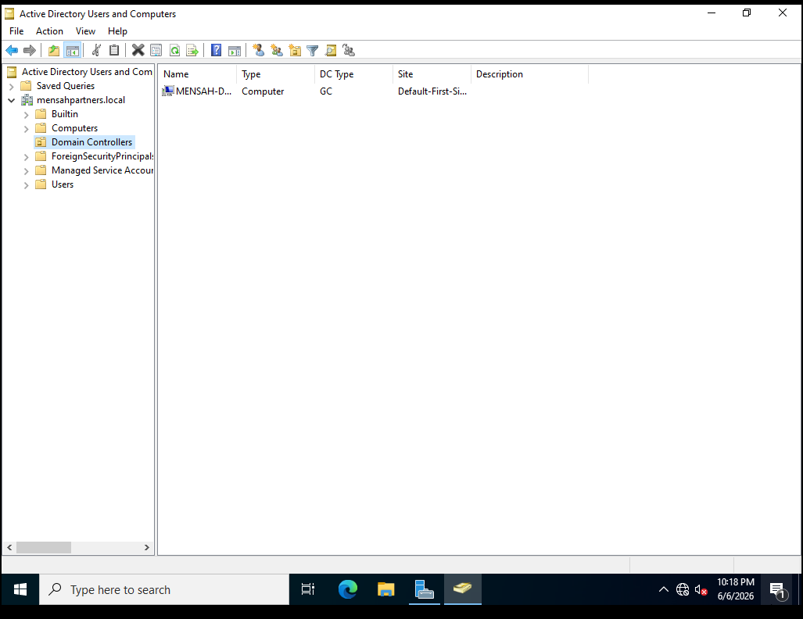

*The Domain Controllers container confirms MENSAH-DC01 is registered and functioning as a Global Catalog server.*

---

## Part 5 — Designing the OU Structure

Before creating anything, the organisational design needs to be clear. Active Directory objects are organised into **Organizational Units (OUs)** — containers that mirror the business structure. Different OUs can have different policies applied to them.

**Mensah & Partners OU design:**

```
mensahpartners.local
├── Finance     ← handles client financial data, strictest policy
├── HR          ← handles employee records and payroll
├── IT          ← administers the environment, least restrictive
└── Management  ← access to reports across departments
```

Four OUs were created under `mensahpartners.local` with *Protect container from accidental deletion* enabled on each — this prevents OUs from being removed without first disabling the protection, avoiding costly mistakes.


*Four OUs created: Finance, HR, IT, and Management — mirroring the firm's department structure.*

---

## Part 6 — Creating Security Groups

One **Global Security Group** was created inside each OU. Security Groups control access to resources — shared folders, printers, applications.

The key principle: **permissions are never assigned to individual users, only to groups.** This keeps access management consistent and auditable as the organisation grows. Adding or removing someone's access means adding or removing them from a group — not modifying permissions on every resource they touch.

| Security Group | Location |
|----------------|----------|
| Finance-Staff | Finance OU |
| HR-Staff | HR OU |
| IT-Staff | IT OU |
| Management-Staff | Management OU |


*Finance OU containing the Finance-Staff security group.*

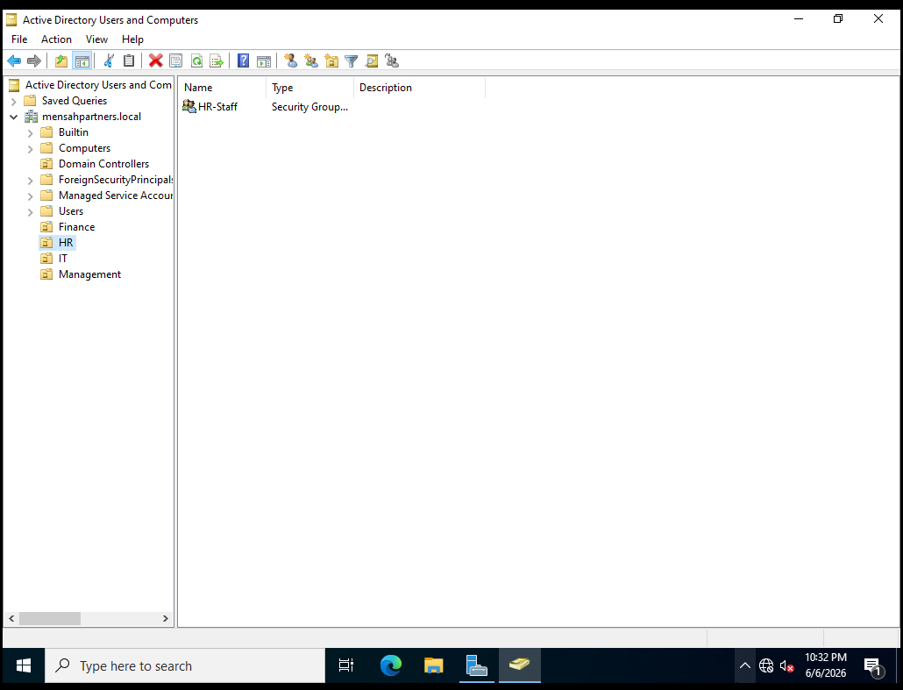

*HR OU containing the HR-Staff security group.*


*IT OU containing the IT-Staff security group.*

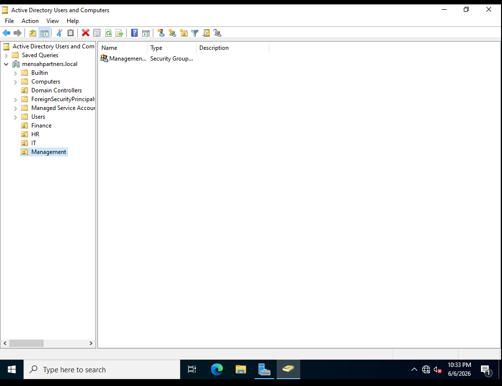

*Management OU containing the Management-Staff security group.*

---

## Part 7 — Creating Domain User Accounts

Eight domain user accounts were created and placed inside their respective department OUs.

| Full Name | Username | Department |
|-----------|----------|------------|
| Akosua Mensah | akosua.mensah | Finance |
| Kwame Asante | kwame.asante | Finance |
| Abena Osei | abena.osei | HR |
| Kofi Boateng | kofi.boateng | HR |
| Yaw Darko | yaw.darko | IT |
| Abdulai Iddrisu | abdulai.iddrisu | IT |
| Kweku Mensah | kweku.mensah | Management |
| Adwoa Asante | adwoa.asante | Management |

Each user was then added to their department's Security Group via the group's Properties → Members tab.

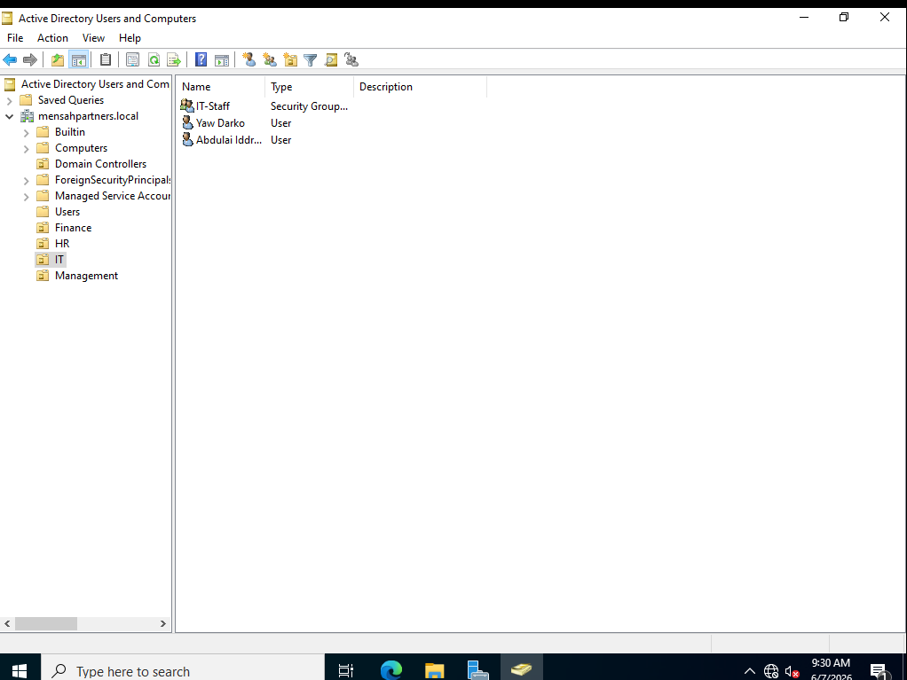

*IT OU showing the IT-Staff security group alongside domain users Yaw Darko and Abdulai Iddrisu.*

---

## Part 8 — Configuring Domain-Level Password Policy

Group Policy is managed through **Group Policy Management** in Server Manager Tools. The **Default Domain Policy** applies to every user and computer in the domain — this is where password and lockout rules are set.

### Before: Default password policy settings

The default settings are too weak for a firm handling sensitive financial data.

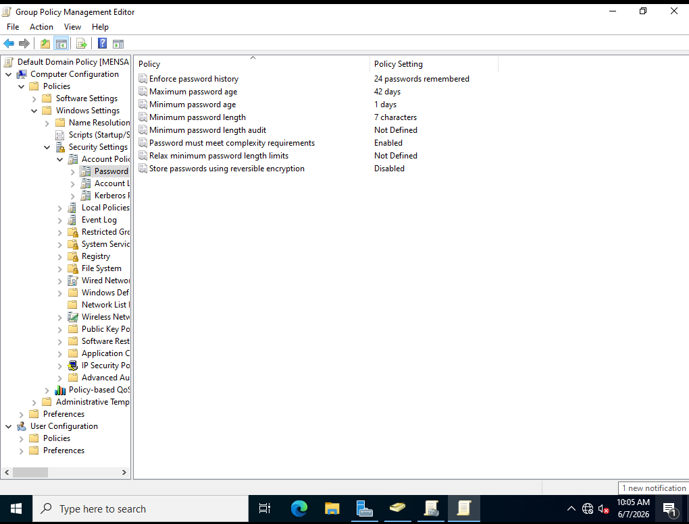

*Default policy: 7-character minimum, 42-day expiry, 24-password history. Not sufficient for a regulated environment.*

### After: Updated password policy

| Setting | Old Value | New Value |
|---------|-----------|-----------|
| Enforce password history | 24 | 10 |
| Maximum password age | 42 days | 90 days |
| Minimum password age | 1 day | 1 day |
| Minimum password length | 7 characters | 10 characters |
| Complexity requirements | Enabled | Enabled |

**Why minimum password age of 1 day matters:** Without it, a user forced to change their password could immediately cycle through passwords until they return to their original one, bypassing the history requirement entirely. One day per password makes this impractical.

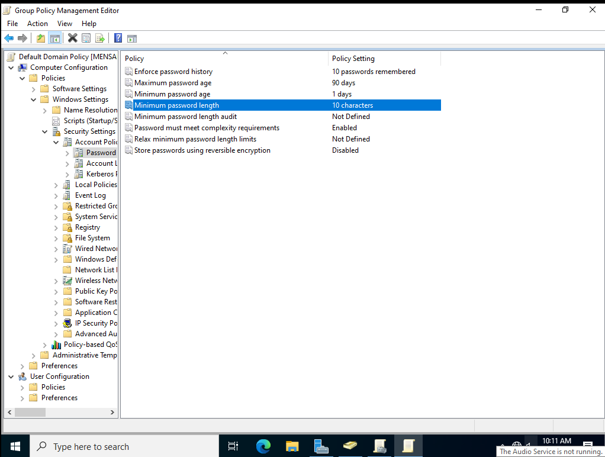

*Updated policy: 10-character minimum, 90-day expiry, 10-password history. Complexity enabled.*

### Account Lockout Policy

Account lockout protects against brute force attacks. Without it, an attacker can attempt unlimited password combinations automatically until they succeed.

| Setting | Value |
|---------|-------|
| Account lockout threshold | 5 invalid attempts |
| Account lockout duration | 30 minutes |
| Reset lockout counter after | 30 minutes |

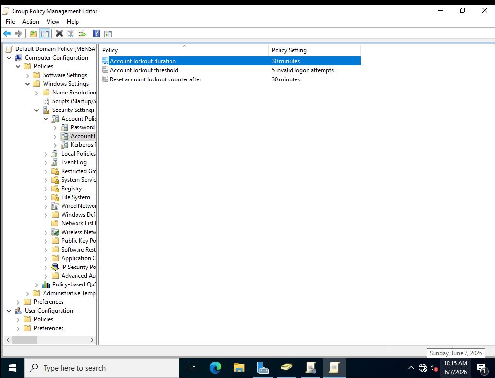

*Account lockout configured: 5 failed attempts triggers a 30-minute lockout.*

---

## Part 9 — Configuring Department GPOs

Each OU gets its own GPO linked directly to it. These layer on top of the domain-level policy — OU policies apply in addition to, not instead of, the domain policy.

### Finance-Policy

Finance handles client tax records and financial data — the strictest policy.

**Why block Command Prompt for Finance?** Standard Finance users have no legitimate need for command line access. A Finance employee with CMD access could map network drives to restricted folders, run scripts to extract data, or provide an entry point for malware to move laterally across the network.

**Why block all removable storage classes, not just USB?** USB is one type of removable storage. Blocking only USB leaves SD cards, external drives, and other media as viable data exfiltration paths. Denying all removable storage classes closes every avenue with one setting.

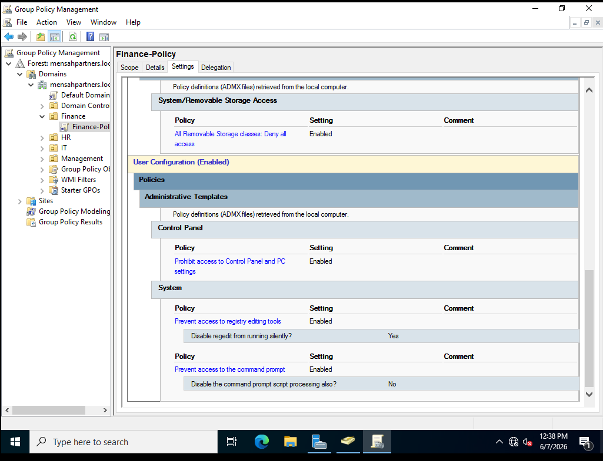

*Finance-Policy: Removable storage blocked, Control Panel blocked, Registry Editor blocked, Command Prompt blocked.*

### Management-Policy

Management needs access to business reports but does not need to modify system settings. USB blocked, Control Panel blocked, Command Prompt accessible.

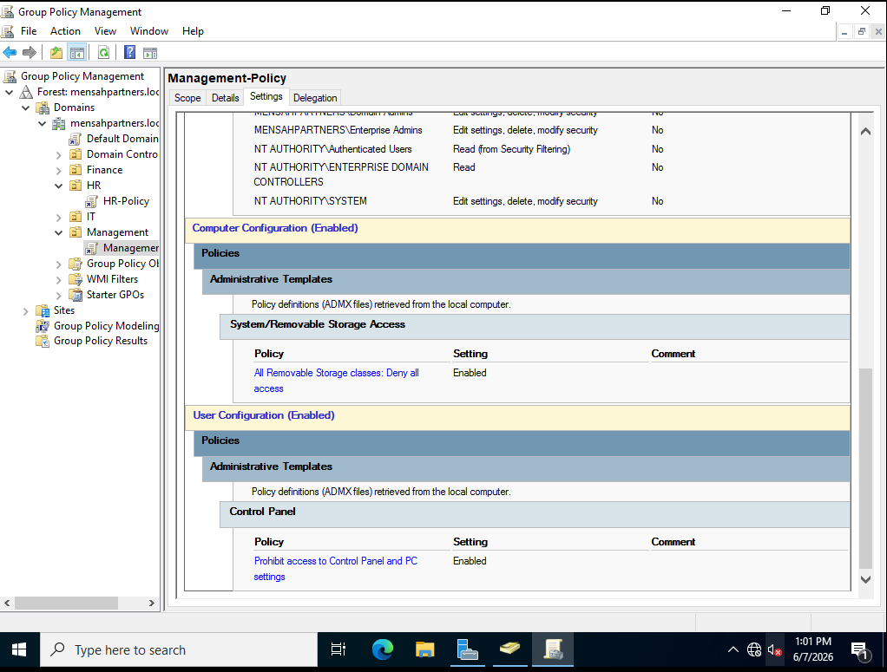

*Management-Policy: Removable storage blocked, Control Panel blocked.*

### IT-Policy

IT administers the entire environment. Restricting their tools would prevent them from doing their job. IT gets the least restrictive policy — no restrictions on CMD, Control Panel, or software.

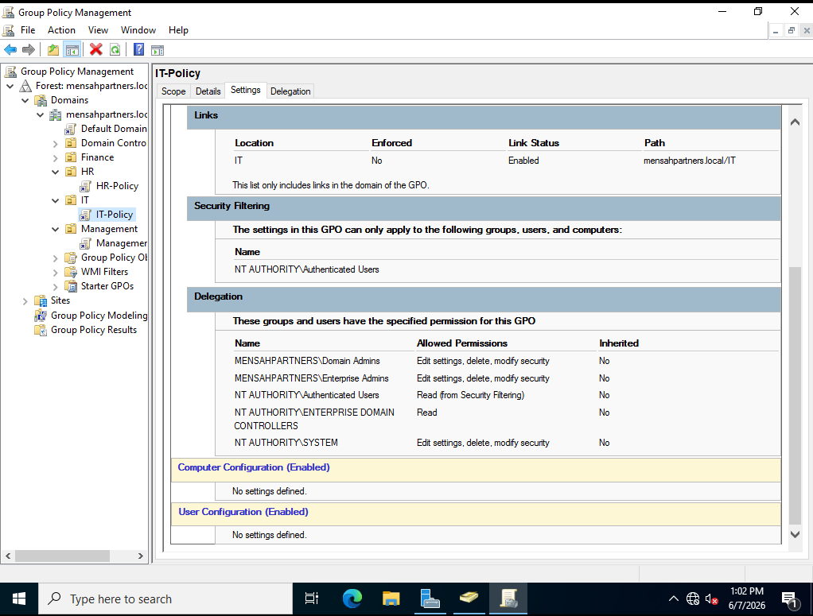

*IT-Policy: No restrictions defined. IT staff retain full access to administrative tools.*

### HR-Policy

HR handles employee records and payroll data. USB blocked, Control Panel blocked. CMD retained for payroll processing tools.

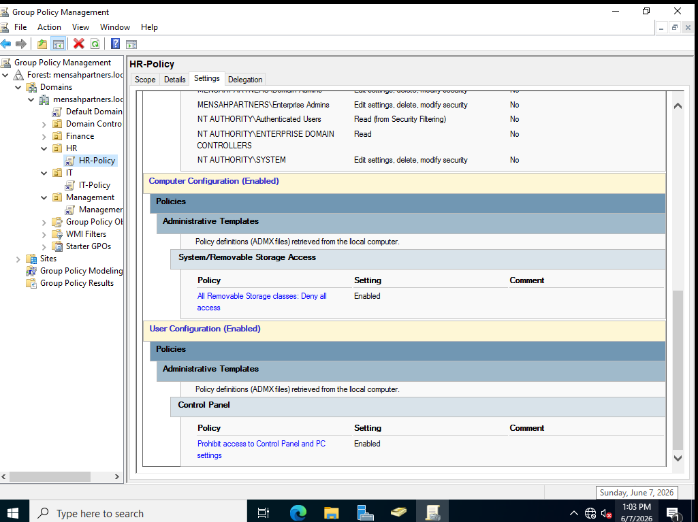

*HR-Policy: Removable storage blocked, Control Panel blocked.*

---

## Part 10 — Setting Up the Client Workstation

A second VM was created running Windows 10 Pro, configured on the same VMnet1 network as the Domain Controller.

**Static IP configured on the client:**
- IP Address: `192.168.10.2`
- Subnet Mask: `255.255.255.0`
- Default Gateway: `192.168.10.1`
- Preferred DNS: `192.168.10.1`

**Why must DNS point to the DC?** When the client tries to join `mensahpartners.local`, it needs to look up that domain name in DNS. Public DNS servers like Google's 8.8.8.8 have no knowledge of `mensahpartners.local` — it's an internal domain. Only the DC's DNS server knows about it. Pointing to a public DNS server causes the domain join to fail.

### Troubleshooting: VMware DHCP conflict

Initial connectivity test failed — the client was receiving `192.168.249.129` instead of the configured `192.168.10.2`. VMware's built-in DHCP service on VMnet1 was overriding the static IP configuration.

**Fix:** Virtual Network Editor → VMnet1 → unchecked "Use local DHCP service to distribute IP addresses to VMs." Static IP then applied correctly.

After fixing the IP conflict, connectivity between the two machines was verified:

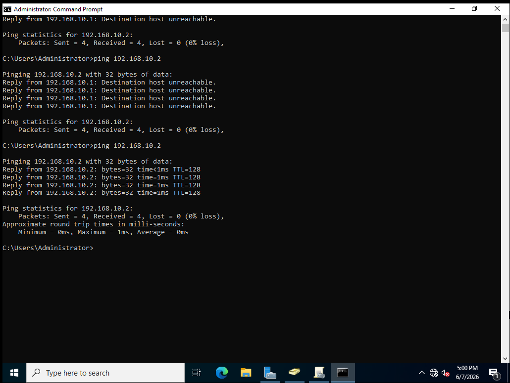

*Ping from MENSAH-DC01 to 192.168.10.2: 4 packets sent, 4 received, 0 lost. Network connectivity confirmed.*

### Joining the Domain

On the client machine: right-click Start → System → Rename this PC (advanced) → Change → Domain → `mensahpartners.local`. Authenticated with the domain Administrator account.

After successfully joining, the client machine appeared immediately in the **Computers** container in Active Directory Users and Computers on the DC.

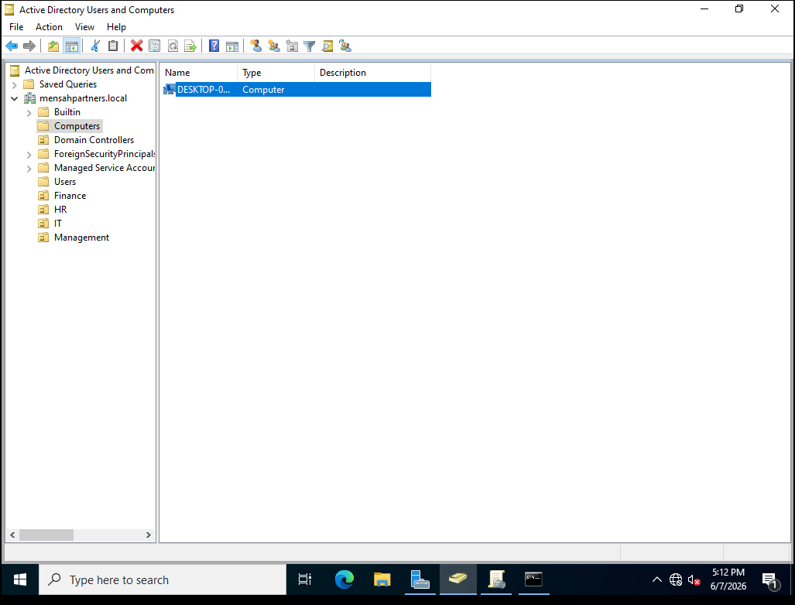

*The client workstation appears in the Computers container in AD, confirming the domain join was successful.*

---

## Part 11 — Testing GPO Enforcement

This is the critical step. GPOs mean nothing if they don't actually enforce on client machines. Two users were tested: one from Finance, one from IT.

### Test 1: Finance User — akosua.mensah

Logged into the client workstation as `akosua.mensah`.

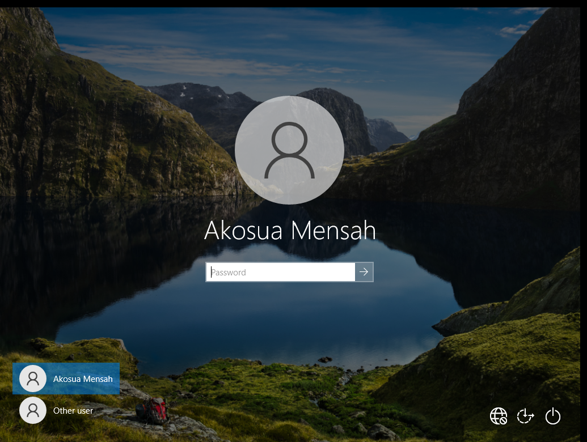

*Client workstation login screen showing Akosua Mensah — a Finance department domain user.*

**CMD Test — should be blocked:**

Attempted to open Command Prompt. The Finance-Policy GPO kicked in immediately.

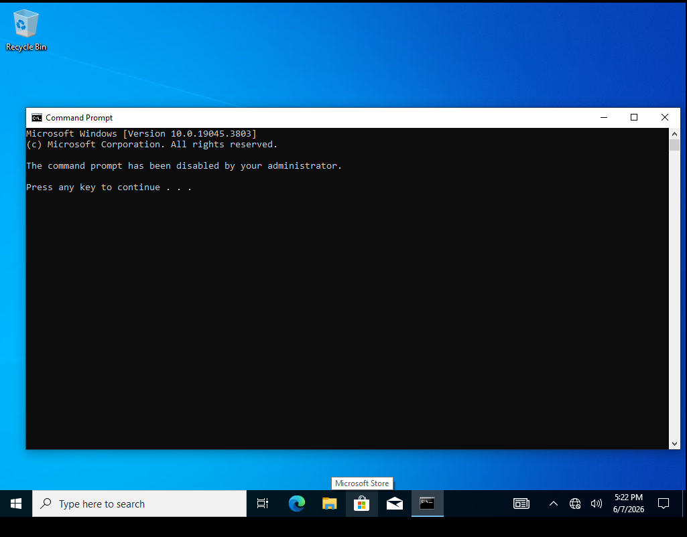

*"The command prompt has been disabled by your administrator." — Finance-Policy GPO enforcing correctly.*

**Control Panel Test — should be blocked:**

Attempted to open Control Panel. Blocked.

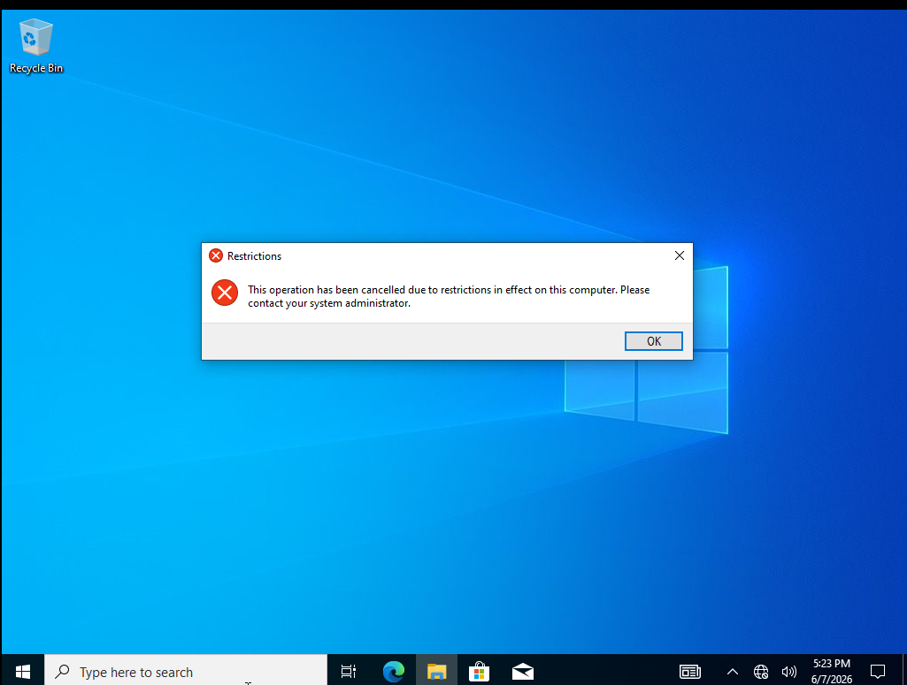

*"This operation has been cancelled due to restrictions in effect on this computer." — Control Panel block confirmed.*

**Registry Editor Test — should be blocked:**

Ran `regedit` via Windows Run dialog. Blocked.

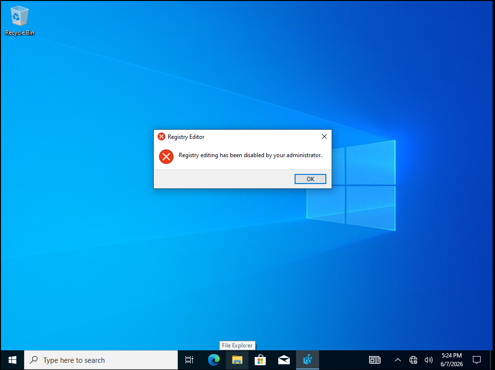

*"Registry editing has been disabled by your administrator." — Registry Editor block confirmed.*

All three Finance-Policy restrictions enforced correctly.

---

### Test 2: IT User — yaw.darko

Logged out of Akosua Mensah and logged in as `yaw.darko`.

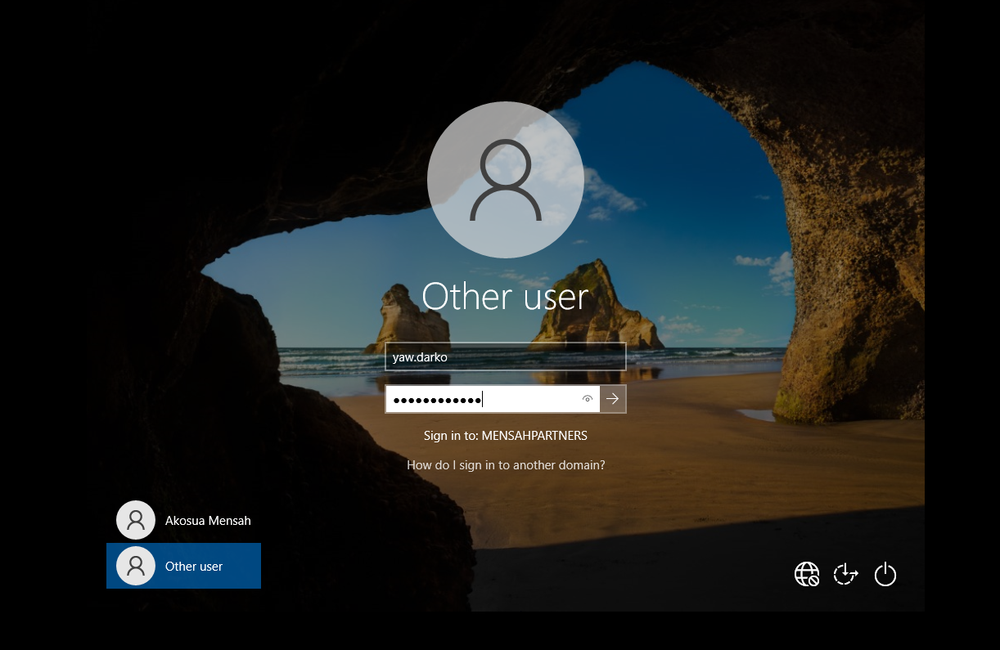

*Logging in as yaw.darko from the IT department. Sign in to: MENSAHPARTNERS domain.*

**CMD Test — should be accessible:**

Opened Command Prompt and ran `whoami` to confirm domain identity.

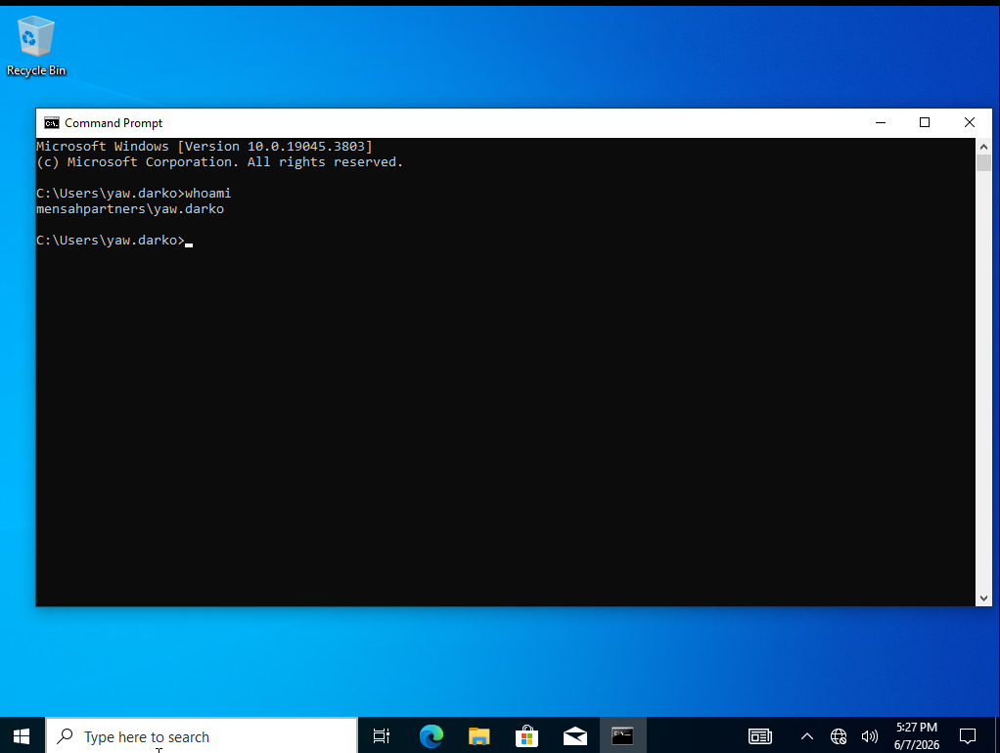

*CMD opens for IT user. `whoami` returns `mensahpartners\yaw.darko` — confirms domain login and unrestricted CMD access.*

**Control Panel Test — should be accessible:**

Opened Control Panel. Accessible.

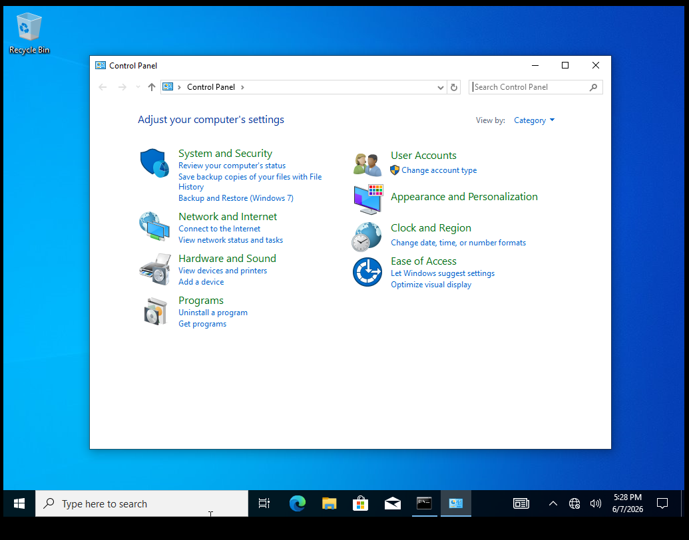

*Control Panel opens fully for the IT user — no restrictions applied.*

**Bonus — UAC prompt confirms domain enforcement:**

When an IT user attempts to make system-level changes, Windows prompts for admin credentials and correctly shows **Domain: MENSAHPARTNERS** — confirming domain policy is in effect even when access is granted.

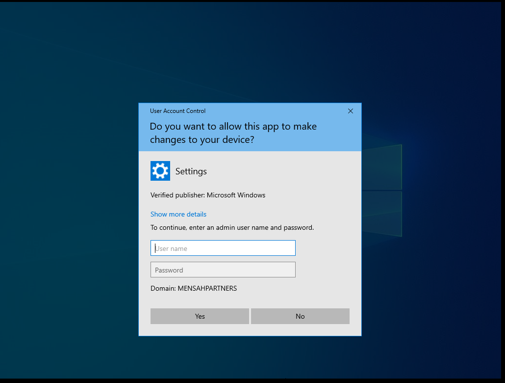

*UAC prompt requesting admin credentials shows Domain: MENSAHPARTNERS — domain policy active throughout.*

---

## Test Results Summary

| Test | User | Expected | Result |
|------|------|----------|--------|
| Command Prompt | akosua.mensah (Finance) | Blocked | ✅ Blocked |
| Control Panel | akosua.mensah (Finance) | Blocked | ✅ Blocked |
| Registry Editor | akosua.mensah (Finance) | Blocked | ✅ Blocked |
| Command Prompt | yaw.darko (IT) | Accessible | ✅ Accessible |
| Control Panel | yaw.darko (IT) | Accessible | ✅ Accessible |
| Domain identity (whoami) | yaw.darko (IT) | mensahpartners\yaw.darko | ✅ Confirmed |

---

## What I Learned

I came into this knowing Active Directory conceptually. Building it myself made the concepts real.

The most important thing I learned is that **DNS underpins everything in Active Directory**. When the client machine couldn't join the domain, the fix wasn't an AD setting — it was pointing DNS to the Domain Controller. One change made everything work. You don't really understand that dependency until you've broken it and fixed it yourself.

The troubleshooting process also taught me something practical: **file size does not verify file integrity**. The original Windows Server 2022 ISO was corrupted — it was exactly the correct size but would not boot. The right way to verify a downloaded ISO is a SHA256 checksum:

```powershell
Get-FileHash filename.iso -Algorithm SHA256
```

Compare the output against Microsoft's published hash before using any ISO.

---

## The Hardest Part

Getting the environment running took longer than building the AD environment itself. The original attempt used VirtualBox, which has known compatibility issues with Windows 11 26H2. After exhausting every VirtualBox fix — boot order, UEFI settings, disabling Hyper-V, changing graphics controllers, recreating the VM — the decision was made to switch to VMware Workstation Pro. The switch immediately resolved the hypervisor issues. Then a corrupted ISO caused further boot failures before a fresh download fixed everything.

The lesson: systematic troubleshooting has value even when the root cause turns out to be simple. Every step eliminated a variable. The process of elimination is what led to the correct diagnosis.

---

## Policy Summary

### Domain-Level Policy (applies to all users)

| Setting | Value |
|---------|-------|
| Minimum password length | 10 characters |
| Password complexity | Enabled |
| Maximum password age | 90 days |
| Password history | 10 passwords |
| Account lockout threshold | 5 attempts |
| Lockout duration | 30 minutes |

### Department-Level Policies

| Policy | Finance | HR | IT | Management |
|--------|---------|----|----|------------|
| USB/Removable storage blocked | ✅ | ✅ | ❌ | ✅ |
| Control Panel blocked | ✅ | ✅ | ❌ | ✅ |
| Command Prompt blocked | ✅ | ❌ | ❌ | ❌ |
| Registry Editor blocked | ✅ | ❌ | ❌ | ❌ |

---

## What's Next

This is Project 1 of 3.

**Project 2:** AWS Infrastructure as Code — deploying a production-grade multi-tier architecture on AWS using Terraform, modeled on a real Ghanaian fintech use case.

**Project 3:** Network monitoring and incident response lab — building proactive visibility into a simulated SME network environment using open-source monitoring tools.

---

*Built by Abdulai Yorli Iddrisu*
